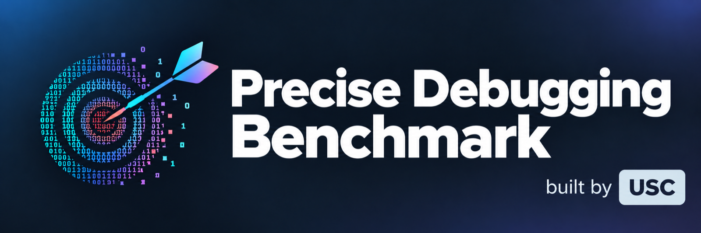

<p align="center">
  
</p>

<p align="center">
  <a href="https://neurips.cc/"></a>
  <a href="https://arxiv.org/abs/2604.17338"></a>
  <a href="https://precise-debugging-benchmark.github.io/"></a>
  <a href="https://huggingface.co/Precise-Debugging-Benchmarking"></a>
</p>

<p align="center">
  
  
  <a href="LICENSE"></a>
</p>

<p align="center">
  <a href="#-installation">Installation</a> ·
  <a href="#-evaluate-a-model-on-pdb-single--single-hard--multi">Evaluate</a> ·
  <a href="#-score-an-existing-debug-results-file">Score</a> ·
  <a href="#-generate-your-own-pdb-test-set">Generate</a> ·
  <a href="#-iterative-or-agentic-debugging">Agentic</a> ·
  <a href="#-reproduce-experiments">Reproduce</a> ·
  <a href="#-citation">Citation</a> ·
  <a href="https://precise-debugging-benchmark.github.io/leaderboard.html">🏆 Leaderboard</a>
</p>

---

**PDB** is an automatic pipeline that turns any coding dataset into a *debugging* benchmark with fine-grained metrics. Beyond binary unit-test scores, PDB evaluates a debugger with:

| metric | question it answers |
|---|---|
| 🎯 **Edit-level precision** | Did the model touch only the lines it had to? |
| 🧩 **Bug-level recall** | Did it fix every fault? |
| ✅ **Unit score** | Does the patched program pass the tests? |

This rewards targeted fixes and penalizes the regeneration behavior frontier LLMs often fall back on.

> [!NOTE]
> **TL;DR** — Frontier models like GPT-5.1-Codex and DeepSeek-V3.2-Thinking top unit-test leaderboards (>76%) but score at or below 45% on precision: they pass tests by rewriting, not repairing. PDB makes that gap measurable.

### 📚 Releases

- Released datasets: [`PDB-Single`](https://huggingface.co/datasets/Precise-Debugging-Benchmarking/PDB-Single) · [`PDB-Single-Full`](https://huggingface.co/datasets/Precise-Debugging-Benchmarking/PDB-Single-Full) · [`PDB-Wild`](https://huggingface.co/datasets/Precise-Debugging-Benchmarking/PDB-Wild) (BigCodeBench/LiveCodeBench part: [`PDB-Multi`](https://huggingface.co/datasets/Precise-Debugging-Benchmarking/PDB-Multi)) · model outputs and scores: [`PDB-Results`](https://huggingface.co/datasets/Precise-Debugging-Benchmarking/PDB-Results)
- Repository-level bugs (PDB-Wild): 228 multi-line bugs in 6 SWE-smith repositories, [`results/swesmith/bug_data/swesmith_pdb_multi.json`](results/swesmith/bug_data/swesmith_pdb_multi.json) — see [dataset/swesmith/README.md](dataset/swesmith/README.md)

## 📦 Installation

We use [`uv`](https://docs.astral.sh/uv/) for reproducible environments.

```bash
git clone https://github.com/Bill1235813/PDB
cd PDB
uv sync                        # creates .venv, installs locked deps
source .venv/bin/activate      # optional; scripts already point at .venv/bin/python
```

The LiveCodeBench and BigCodeBench sandboxes live in separate uv envs:

```bash
cd dataset/bigcodebench/install   && uv sync --extra eval && cd -
cd dataset/livecodebench/install  && uv sync              && cd -
```

SWE-smith tasks are validated in the repositories' Docker images; they need a running Docker daemon and one extra:

```bash
uv sync --extra swesmith
```

### API keys

Drop one key file per provider into [keys/](keys/) (each file is a single line with the raw key). Mapping, local-model setup, and `--model_api_file` override instructions are in [keys/README.md](keys/README.md).

## 🧪 Evaluate a model on PDB (single / single-hard / multi)

Bug-correct + score one model across both BigCodeBench and LiveCodeBench:

```bash
bash scripts/simple_debug_eval.sh <subset> <model>
```

- `<subset>` ∈ `single`, `single-hard`, `multi` (points at `<bench>_pdb_<subset>.json`).
- `<model>` is any [dspy](https://dspy.ai/) model string: `openai/gpt-5.1-codex`, `anthropic/claude-sonnet-4-5-20250929`, `deepseek/deepseek-chat`, etc. Local / self-hosted endpoints are supported too — see [scripts/README.md](scripts/README.md#local--self-hosted-model-evaluation).

Example output (Evaluator per-dataset lines + driver union):

```
[summary] gpt-5.1-codex on bigcodebench_pdb_single_hard round 1: unit=0.631 prec=0.421 rec=0.699 f1=0.484 (n=2525)
[summary] gpt-5.1-codex on livecodebench_pdb_single_hard round 1: unit=0.891 prec=0.374 rec=0.735 f1=0.457 (n=3226)
  union  unit=0.777 prec=0.394 rec=0.720 f1=0.469 (n=5751)
```

To loop a fixed list of reference models instead of one, run [scripts/run_debug_eval.sh](scripts/run_debug_eval.sh) with the same subset arg. Model list, token budgets, and run-wide knobs (debug mode, rounds, temperature) are configurable at the top of each driver — see [scripts/README.md](scripts/README.md) for details.

## 📐 Score an existing debug-results file

If you already have patches saved (downloaded from Hugging Face, produced by an external agent, etc.), score them without re-running the model:

```bash
python src/evaluator.py \
  --dataset_name bigcodebench \
  --eval_model_name my-model \
  --input_file my-model_on_bigcodebench_pdb_single_round_1.json \
  --eval_set_name bigcodebench_pdb_single \
  --max_iter 1
```

The input format matches what `bug_correct.py` writes (a list of entries with `task_id`, `buggy_code`, `gt_solution`, `debug_results.solution`, `gt_diff`, …). At the end, the same `[summary]` line as above is printed. Output-file paths and schema are documented in [scripts/README.md](scripts/README.md#output-files).

## 🐛 Generate your own PDB test set

Every file under `dataset/<bench>/data/full_data.json` goes through the same pipeline:

```bash
python src/bug_generation.py \
  --dataset_name bigcodebench \
  --model_name openai/gpt-5.1-codex \
  --input_file full_data.json \
  --output_prefix oai_buggy_code \
  --mode single          \   # or --mode multi
  --stride 2             \   # 2 for single, 4 for multi
  --max_lines_per_block 1 \  # 1 for single, 2-4 for multi
  --max_bugs 4            \  # max composed block count (bug_count)
  --bug_per_time 20       \  # per-task LLM call budget
  --max_gen_per_bin 5     \  # subsampling cap
  --temperature 1.0 --max_tokens 32000
```

The generator produces `oai_buggy_code_<timestamp>.json` under `results/<bench>/bug_data/`. Three-model fan-out drivers:

- [scripts/run_bug_gen_single.sh](scripts/run_bug_gen_single.sh) — single-line (3 models × 2 datasets, then merge into `<bench>_pdb_single.json`)
- [scripts/run_bug_gen_multi.sh](scripts/run_bug_gen_multi.sh) — multi-line (reads per-model `long_<name>.json` splits, merges into `<bench>_pdb_multi.json`)

Both scripts preflight API keys against a cheap probe before spending credits, and they run all 6 (model × dataset) jobs concurrently.

### Repository-level bugs (SWE-smith)

[scripts/run_bug_gen_swesmith.sh](scripts/run_bug_gen_swesmith.sh) extracts files from 10 SWE-smith repository images and injects multi-line bugs of up to 30 lines (`--multi_validation span`, which also admits code-move bugs), validating each against the repository's full test suite in Docker. Details in [dataset/swesmith/README.md](dataset/swesmith/README.md).

### Optional test-adequacy gate

PDB keeps a bug only if the inherited tests detect it; whether every *test-passing patch* is correct depends on the upstream suite. [src/test_adequacy.py](src/test_adequacy.py) adds an optional gate to preprocessing:

- **Coverage gate** (`--coverage_gate`): run the suite on the ground truth under a line tracer and exclude editable lines that no test executes from bug injection (each task records the verdict in `coverage`).
- **Test augmentation** (`--augment_tests [--property_based]`): for tasks that fail the gate, an LLM writes extra tests for the unexecuted lines; only tests that pass on the ground truth in every repeated run are kept, and the handler runs them alongside the original suite during bug validation and scoring.

The gate is implemented for `swesmith` (handler hooks `measure_line_coverage` / `run_tests_in_container`; see `dataset/base.py` to add it to other datasets).

### Choose your generator pool

The default pool is GPT-5.1-Codex + Claude-4.5-Sonnet + Gemini-2.5-Pro. Swap the `MODELS` array in `run_bug_gen_*.sh` to taste — anything supported by LiteLLM works.

### Add a new source dataset

Implement a `DatasetHandler` subclass under `dataset/<your-dataset>/` and register it in `dataset/__init__.py`. See [dataset/README.md](dataset/README.md) for the full interface + vendored-sandbox layout. The rest of the pipeline is dataset-agnostic once the handler exists.

### Parameters reference

| flag | default | meaning |
|---|---|---|
| `--mode` | `single` | `single` (1-line bugs) or `multi` (contiguous 2-4 line blocks) |
| `--stride` | `2` | minimum inter-block line gap during composition (`s`) |
| `--max_bugs` | `4` | `k_max` — max bugs composed into a single program |
| `--bug_per_time` | `20` | `m_1` — LLM calls per `(x, C_gt)` pair for atomic-bug drafting |
| `--max_gen_per_bin` | `5` | `m_3` — subsample cap per `(task, bug_count)` bin |
| `--max_lines_per_block` | 1 single / 4 multi | block size cap for diff validation |
| `--temperature` | `1.0` | sampling temperature |
| `--max_tokens` | `32000` | thinking-budget cap |
| `--multi_validation` | `block` | `block`: one contiguous block per bug; `span`: all edits within `--max_lines_per_block` lines (SWE-smith) |
| `--atomicity_full_max_lines` | `4` | bugs up to this many edited lines are checked against every partial repair, larger ones against single-line reverts |
| `--n_workers_llm` / `--n_workers_validation` | `1` / `4` | parallel LLM calls / Docker validation workers |
| `--coverage_gate`, `--augment_tests`, `--property_based` | off | optional test-adequacy gate (above) |

## 🔁 Iterative or agentic debugging

All three flavors below start from an already-scored round-1 single-pass run (produced by `scripts/run_debug_eval.sh` or `simple_debug_eval.sh`) and reload it with `--reload_first_round`, so only rounds 2+ consume fresh API credits.

### Iterative (text-only feedback)

The debugger sees its prior failed patches appended to `failed_attempts`, and the template auto-switches to `*_with_feedback` between rounds. No unit-test content or error traces are exposed.

```bash
python src/bug_correct.py \
  --dataset_name bigcodebench \
  --input_file bigcodebench_pdb_single_hard.json \
  --eval_set_name bigcodebench_pdb_single_hard \
  --model_name openai/gpt-5.1-codex \
  --debug_mode minimal --max_rounds 3 \
  --reload_first_round \
  --reload_result_file results/bigcodebench/debug_results/gpt-5.1-codex_on_bigcodebench_pdb_single_hard_round_1.json \
  --reload_score_file  results/bigcodebench/eval_results/gpt-5.1-codex_on_bigcodebench_pdb_single_hard_round_1_scores.json \
  --temperature 1.0 --max_tokens 32000
```

### Agentic (tests + error messages exposed)

Same as iterative, but `--use_tests` puts the hidden unit tests into the prompt and `--error_msg` injects the sandbox's stdout/stderr for every failing attempt:

```bash
python src/bug_correct.py \
  --dataset_name bigcodebench \
  --input_file bigcodebench_pdb_single_hard.json \
  --eval_set_name bigcodebench_pdb_single_hard_agentic \
  --model_name openai/gpt-5.1-codex \
  --debug_mode minimal --max_rounds 3 \
  --use_tests --error_msg \
  --reload_first_round \
  --reload_result_file results/bigcodebench/debug_results/gpt-5.1-codex_on_bigcodebench_pdb_single_hard_round_1.json \
  --reload_score_file  results/bigcodebench/eval_results/gpt-5.1-codex_on_bigcodebench_pdb_single_hard_round_1_scores.json \
  --temperature 1.0 --max_tokens 32000
```

### Agentic with Claude Code (tool-using subagent)

Swaps the single-pass dspy LM for an autonomous [Claude Code](https://claude.com/claude-code) subagent that can read the buggy code, execute tests, and iteratively patch. Routed through [src/claude_code_wrapper.py](src/claude_code_wrapper.py).

```bash
python src/bug_correct.py \
  --dataset_name bigcodebench \
  --input_file bigcodebench_pdb_single_hard.json \
  --eval_set_name bigcodebench_pdb_single_hard_claudecode \
  --model_name claude-code-agent \
  --use_claude_code \
  --debug_mode minimal --max_rounds 1 \
  --timeout 300
```

`--use_claude_code` implies `--use_tests` internally (the agent is expected to run them), so unit tests are always available. `--max_rounds 1` is typical here because the agent already iterates within its own loop.

Each round of every flavor writes `<model>_on_<eval_set>_round_<k>.json` + its scores file. Prompt templates (`minimal` vs `free`, `*_with_feedback`, `*_unit`) are documented in [scripts/README.md](scripts/README.md#prompt-variants).

## 🔬 Reproduce experiments

### Regenerate `<bench>_pdb_single.json`

```bash
bash scripts/run_bug_gen_single.sh          # 3 generators × 2 datasets + merge
```

### Build `<bench>_pdb_single_hard.json`

After scoring the 9 reference models on `_pdb_single`, filter to tasks solved perfectly by < 7 of 9:

```bash
bash scripts/run_debug_eval.sh single       # populates eval_results/
# then run the hard-filter cell in visualize/visualize.ipynb, or use the
# self-contained routine at the bottom of scripts/push_to_hf.py which follows
# the same logic.
```

This is exactly the procedure that produces the **PDB-Single** release set (5,751 examples).

### Regenerate `<bench>_pdb_multi.json`

Requires the `dataset/<bench>/data/long_<name>.json` per-generator splits of tasks with ≥ 35-line canonical solutions.

```bash
bash scripts/run_bug_gen_multi.sh
```

### Full 9-model evaluation

```bash
bash scripts/run_debug_eval.sh single-hard
bash scripts/run_debug_eval.sh multi
```

Final reproduction targets (union over BCB + LCB):

| subset | n | models evaluated | top precision model | top unit-score model |
|---|---|---|---|---|
| PDB-Single-Full | 7,589 | 9 | Claude-Sonnet-4.5 | DeepSeek-V3.2-Thinking |
| PDB-Single | 5,751 | 9 | Claude-Sonnet-4.5 | DeepSeek-V3.2-Thinking |
| PDB-Multi | 256 | 9 | Claude-Sonnet-4.5 | DeepSeek-V3.2-Thinking |

## ✅ Tests

```bash
uv run --extra test python -m pytest tests     # no API calls, no Docker
```

## 📝 Citation

```bibtex
@article{chai2026pdb,
  title={Precise Debugging Benchmark: Is Your Model Debugging or Regenerating?},
  author={Chai, Miaosen and Zhu, Wang Bill and Wang, Shangshang and Liu, Yejia and Bian, Song and Dong, Honghua and Neiswanger, Willie and Jia, Robin},
  journal={arXiv preprint arXiv:2604.17338},
  year={2026}
}
```
